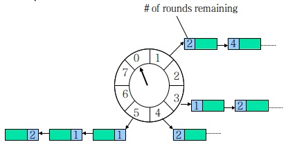

# High Performance Timer for C#/.NET
HashedWheelTimer implemented in C# inspired by io.netty.util.HashedWheelTimer

## What is Hashed Wheel Timer?

It is a timer based on George Varghese and Tony Lauck's paper, [Hashed and Hierarchical Timing Wheels: data structures to efficiently implement a timer facility](http://cseweb.ucsd.edu/users/varghese/PAPERS/twheel.ps.Z). 

The concept on the Timer Wheel is rather simple to understand: in order to keep
track of events on given resolution, an array of linked lists (alternatively -
sets or even arrays, YMMV) is preallocated. When event is scheduled, it's
address is found by dividing deadline time `t` by `resolution` and `wheel size`.
The registration is then assigned with `rounds` (how many times we should go
around the wheel in order for the time period to be elapsed).

For each scheduled resolution, a __bucket__ is created. There are `wheel size`
buckets, each one of which is holding `Registrations`. Timer is going through
each `bucket` from the first until the next one, and decrements `rounds` for
each registration. As soon as registration's `rounds` is reaching 0, the timeout
is triggered. After that it is either rescheduled (with same `offset` and amount
of `rounds` as initially) or removed from timer.

Hashed Wheel is often called __approximated timer__, since it acts on the
certain resolution, which allows it's optimisations. All the tasks scheduled for
the timer period lower than the resolution or "between" resolution steps will be
rounded to the "ceiling" (for example, given resolution 10 milliseconds, all the
tasks for 5,6,7 etc milliseconds will first fire after 10, and 15, 16, 17 will
first trigger after 20).

If you're a visual person, it might be useful for you to check out [these
slides](http://www.cse.wustl.edu/~cdgill/courses/cs6874/TimingWheels.ppt),
which help to understand the concept underlying the Hashed Wheel Timer better.

